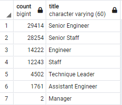
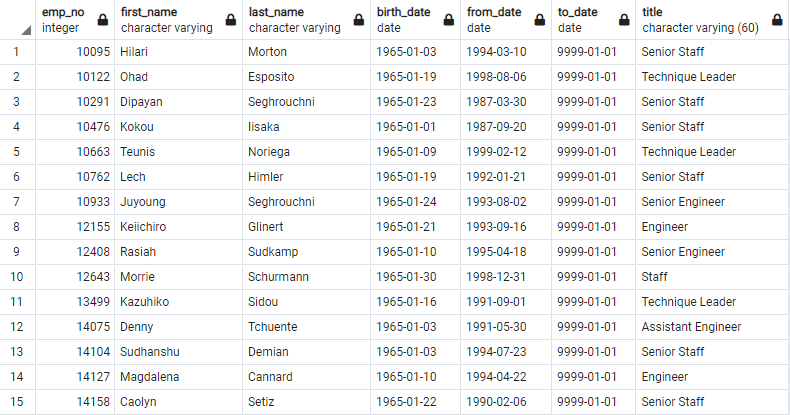
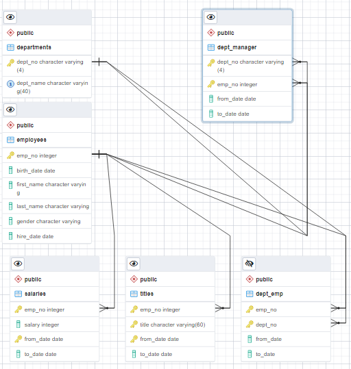
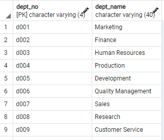

# Pewlett-Hackard-Analysis

## Resources

* Data Tools: PostgreSQL, pgAdmin
* Data Source: Employee_Database_challenge.sql

## Overview of the analysis

The purpose of this analysis is to figure out the number of future retirees for Pewlett Hackard.
We will be looking at employees from all departments currently employed by Pewlett Hackard. The 
company wants to prepare a plan to hire new staff and start a mentorship initiative. We will be 
analyzing birth dates from 1952 to 1955 as well as hired dates from 1985 to 1988.

## Results

* The above image shows a large number of employees that will be eligible to retire in the future.
Many of them hold senior tites and make up well over half the list. 

* The above image lists fifteen of the 1549 candidates that can qualify to become members of the 
mentorship program.

* The above image shows the ERD (Entity Relationship Diagram) used for this analysis. It is used to 
visualize the relationship between the data and plan we are using to enact the analysis. It allows
us tie everything together in a visual format.

* The above image shows the various departments that were included in the analysis. Some departments
were impacted more than others.

## Summary

Currently there are 90,398 employees that are eligible to retire in the coming years and 1549 
candidates that qualify to become members of the mentorship program. Those numbers alone would 
suggest Pewlett Hackard has a problem. If more employees are allowed to enter the mentorship 
program and the pace of retirement is spread out evenly over the coming years Pewlett Hackard may be able to make this work. 

Two ways to alleviate this issue is to create a query that will list who is retiring each year and 
from there Pewlett Hackard can plan how many people it needs to have enter the mentorship program 
to replace those retiring. Also, create a query that shows the title of each employee entering the 
mentorship program. This will enable the company to fill the retirees' roles quicker and more 
efficiently.

